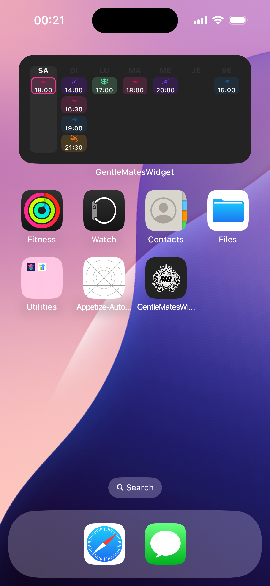
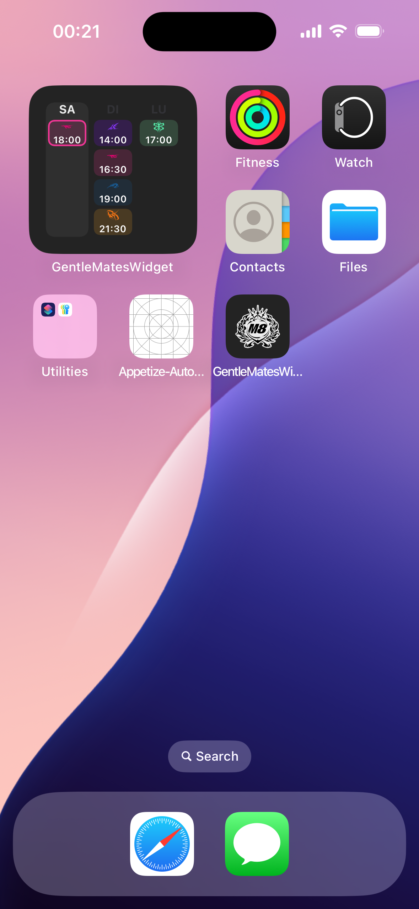

# Gentle Mates — Widget iOS « Prochains matchs »

[](https://github.com/Rom1420/GentleMatesWidget/actions/workflows/build.yml)


Un widget iOS (non officiel) qui affiche le **calendrier des prochains matchs de [Gentle Mates](https://gentlemates.com)** directement sur l'écran d'accueil.

> **Preuve de concept, mais prête pour la vraie vie.** Les données sont mockées aujourd'hui, mais toute
> l'architecture est faite pour brancher la vraie API M8 en **remplaçant une seule classe** — rien d'autre.

---

## Le pourquoi

Ça fait un moment que je rêve d'avoir les **prochains matchs M8 sur mon écran d'accueil**, sans ouvrir
l'app ni fouiller Twitter. Un coup d'œil, je sais quand joue l'équipe. Mes potes fans aussi en parlent
tout le temps.

L'app officielle Gentle Mates est top pour le reste, mais **il n'y a pas de widget**. Alors j'en ai fait
un — d'abord pour nous, et pour montrer concrètement à quoi ça pourrait ressembler.

## On n'est pas les seuls à le vouloir

Ce n'est pas juste mon avis : la demande revient **noir sur blanc dans les avis App Store** de l'app 🇫🇷 :

> ⭐️⭐️⭐️⭐️⭐️ **Twy-kse** — *« Géniale mais quelques fonctionnalités à ajouter »*
> « Je regrette qu'elle ne profite pas plus des fonctionnalités Apple comme les **Widget**, pour par
> exemple suivre les prochains matchs ou les activités en direct lors d'un match. Avec ces petits ajouts
> elle serait parfaite 😍 »

> ⭐️⭐️⭐️⭐️⭐️ **Le_Codeur_Faussaire** — *« La màj de l'appli est pas mal ! »*
> « Il manque encore une chose : **un widget du calendrier des matchs**. J'ai mon calendrier perso en
> widget et j'aimerais bien avoir celui des matchs aussi. »

> ⭐️⭐️⭐️⭐️⭐️ **DarkFord** — *« Ajout possible »*
> « Pouvoir **exporter le calendrier** pour le mettre dans nos calendriers. »

> ⭐️⭐️⭐️⭐️ **HugoPeter67** — *« Trop bien ! »*
> « J'aimerais des **notifications sur les matchs en cours**. »

*(Avis publics sur l'App Store fr de l'app « Gentle Mates », consultés en juillet 2026.)*

Bref : les fans veulent voir les matchs **sans effort**, sur leur écran d'accueil. C'est exactement ce que fait ce widget.

---

## Aperçu

<p align="center">
  
  &nbsp;&nbsp;
  
</p>

<p align="center"><em>medium = la semaine (7 jours) · small = 3 prochains jours · le match en cours a une bordure aux couleurs du jeu.</em></p>

### 🎬 En vidéo

▶️ **[Voir la démo (≈30 s)](docs/demo.mp4)** — le lecteur s'ouvre au clic.

> Rendu capturé sur simulateur via [Appetize.io](https://appetize.io) (build produit par la CI GitHub Actions).

---

## Ce que fait le widget

- 🗓️ **Vue calendrier** en colonnes par jour (`LU MA ME…`), le jour courant surligné.
- 🎮 **Logo du jeu + heure** (format 24h) pour chaque match, jusqu'à **4 matchs par jour**.
- 🔴 **Match en cours** signalé par une **bordure de la couleur du jeu**.
- 📐 **2 tailles** : *small* (3 prochains jours) et *medium* (la semaine).
- 🎨 Couleurs et pictogrammes **par jeu** (Valorant, Rocket League, CS2, Fortnite, TFT…), centralisés
  dans un fichier de design tokens.

---

## Comment ça s'intègre chez M8 (plus tard)

C'est le cœur du projet : **la source de données est totalement isolée du reste du code.**

```
┌────────────────────┐    ┌───────────────────────┐    ┌────────────────────┐
│ MatchWidgetView    │ ─▶ │ MatchTimelineProvider │ ─▶ │ MatchesProvider    │  (protocole)
│ (SwiftUI)          │    │ (WidgetKit)           │    └─────────┬──────────┘
└────────────────────┘    └───────────────────────┘              │
                                                    ┌─────────────┴──────────────┐
                                                    ▼                            ▼
                                         MockMatchesProvider          GentleMatesAPIProvider
                                         (données factices — actif)   (stub → vraie API M8)
                                                    ▲
                                                    │  choisi à un seul endroit
                                             ProviderFactory.makeProvider()
```

Le widget, la timeline et les vues ne connaissent **que le protocole** `MatchesProvider`. Résultat :

> **Le jour où M8 donne un accès à son API, on implémente une classe (`GentleMatesAPIProvider`, déjà
> esquissée), on mappe le JSON réel vers `Match`, et on change une ligne dans `ProviderFactory`.
> Aucune vue, aucune timeline à retoucher.**

Et **pas besoin de backend** : le calendrier des matchs est une donnée publique (déjà affichée sans
compte dans l'app), donc tout reste côté client.

---

## Brancher une vraie API — en 4 étapes

1. **Implémenter** `GentleMatesAPIProvider.fetchUpcomingMatches()`
   ([fichier](GentleMatesWidgetExtension/Providers/GentleMatesAPIProvider.swift)) — un exemple complet
   de requête est déjà en commentaire.
2. **Mapper** le JSON réel vers le contrat stable [`Match`](GentleMatesWidgetExtension/Models/Match.swift)
   (fonction `map(_:)` esquissée).
3. **Renseigner** la config : copier [`APIConfig.example.plist`](GentleMatesWidgetExtension/APIConfig.example.plist)
   en `APIConfig.plist` (gitignoré), y mettre `baseURL` / `apiKey`, et l'ajouter au target de l'extension.
4. **Activer** le provider dans [`ProviderFactory.swift`](GentleMatesWidgetExtension/Providers/ProviderFactory.swift) :

```swift
static func makeProvider() -> MatchesProvider {
    // MockMatchesProvider()      // ← commenter
    GentleMatesAPIProvider()      // ← décommenter
}
```

---

## Lancer le POC

1. Ouvrir `GentleMatesWidget.xcodeproj` dans **Xcode 15+**.
2. Schéma **GentleMatesWidget** + un simulateur iOS 17+, puis `Cmd + R`.
3. Sur le simulateur : appui long sur l'écran d'accueil → **+** → chercher **Gentle Mates** → ajouter le
   widget (*small* ou *medium*).

Le widget tourne sur `MockMatchesProvider` : aucune configuration, aucun réseau, aucun backend.
Les vues se prévisualisent aussi via les `#Preview` de
[`MatchWidgetView.swift`](GentleMatesWidgetExtension/MatchWidgetView.swift).

---

## Stack & structure

**SwiftUI · WidgetKit · iOS 17+** — pas de dépendance externe.

```
GentleMatesWidget.xcodeproj
GentleMatesWidget/                       # app conteneur minimale (héberge l'extension)
GentleMatesWidgetExtension/
├── Providers/
│   ├── MatchesProvider.swift            # le protocole (seule dépendance à la donnée)
│   ├── MockMatchesProvider.swift        # données factices (actif)
│   ├── GentleMatesAPIProvider.swift     # stub de la vraie API
│   ├── APIConfiguration.swift           # config baseURL/apiKey (non commitée)
│   └── ProviderFactory.swift            # switch mock ↔ API (un seul endroit)
├── Models/Match.swift                   # le contrat de données
├── DesignTokens.swift                   # couleurs / pictos par jeu, centralisés
├── GameStyle.swift                      # nom de jeu → couleur / logo
├── MatchTimelineProvider.swift          # TimelineProvider WidgetKit
├── MatchWidgetView.swift                # la vue calendrier
└── GentleMatesWidgetBundle.swift        # @main WidgetBundle
```

Un job **GitHub Actions** (`macos`) compile le projet à chaque push : le `project.pbxproj` étant
écrit à la main, c'est le filet de sécurité qui garantit que le repo reste buildable.

---

## Périmètre & idées pour la suite

Volontairement resserré pour un POC :

- ✅ Vue calendrier, tailles small + medium, jusqu'à 4 matchs/jour, indicateur live.
- 🔜 Pistes (aussi réclamées dans les avis) : **Live Activities** pour un match en cours,
  **export ICS** du calendrier, deep link vers l'app, filtre par jeu.
- ❌ Pas de backend, pas de config utilisateur pour l'instant.

---

## Disclaimer

Projet **non officiel**, fait par un fan, **non affilié à Gentle Mates**. Le nom, le logo et les
pictogrammes de jeux appartiennent à **Gentle Mates / leurs ayants droit** et ne sont utilisés ici que
pour cette démo. Les données affichées sont **fictives** (mock). Si un ayant droit souhaite un
changement, il suffit de me contacter.

*M8 si tu me lis : l'archi est prête, y'a plus qu'à brancher l'API 👀*
